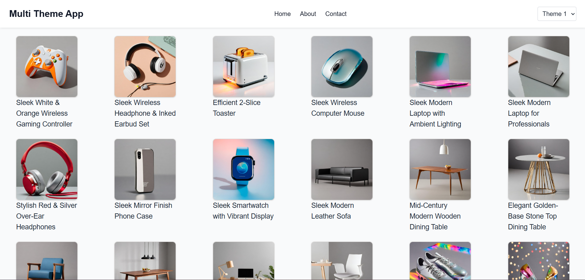
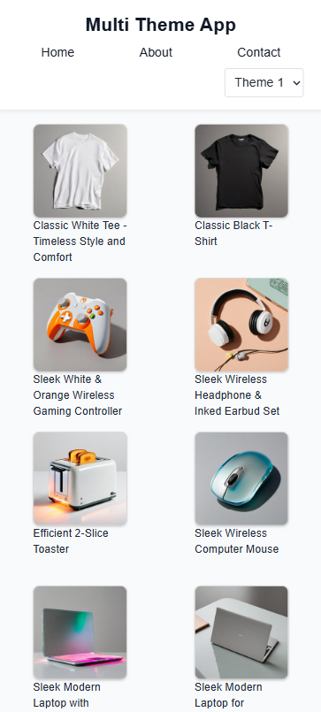
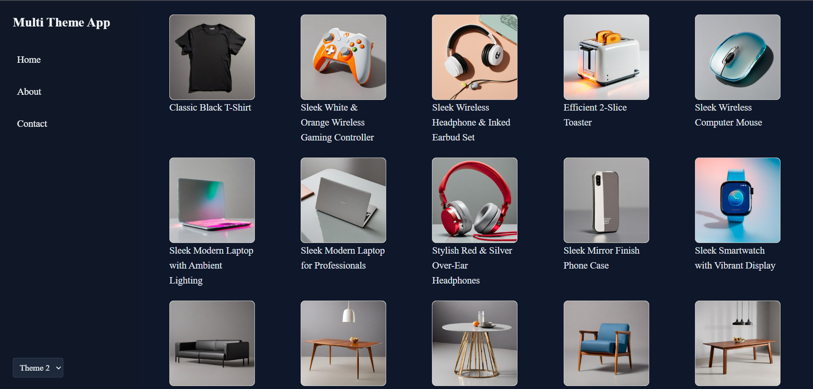
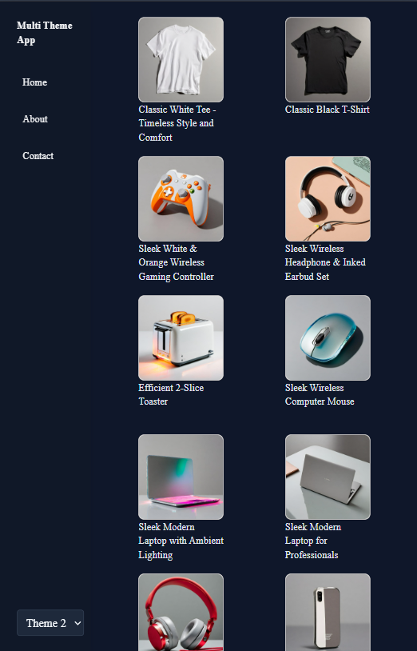
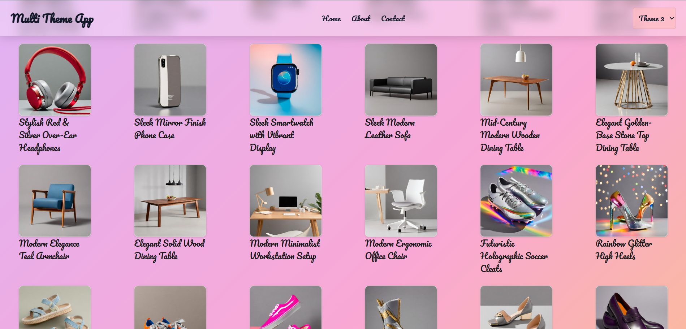
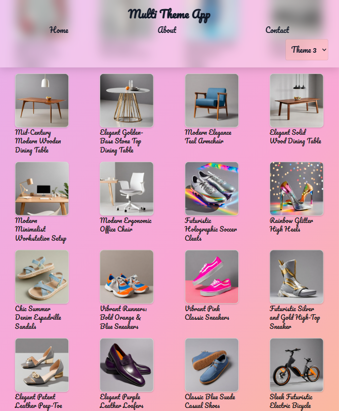

# 🎨 Multi-Theme Switcher App

 


A **React + TypeScript + TailwindCSS** web application demonstrating **multi-theme switching** with **structural layout changes** (header-only, sidebar, grid-based layouts).  

Deployed here: **[Live Demo →](https://multi-theme-switcher-livid.vercel.app/)**

---

## 📸 Screenshots

### Theme 1 – Minimalist Light



### Theme 2 – Dark Mode with Sidebar



### Theme 3 – Colorful Playful Grid



---

## ✨ Features
- **3 Distinct Themes**  
  - **Theme 1:** Light mode, clean sans-serif layout.  
  - **Theme 2:** Dark mode with **sidebar navigation**, bold serif font.  
  - **Theme 3:** Playful mode **colorful** with Google "Pacifico" font.
- **Persistent Theme:** Remembers your preference using `localStorage`.
- **Dynamic Layouts:** Each theme alters structure, fonts, spacing & colors.  
- **API Integration:** Fetches live products from [Platzi Fake Store API](https://api.escuelajs.co/api/v1/products).  
- **Routing:** Home, About, and Contact pages with shared theme context.  
- **Responsive:** Optimized for mobile, tablet & desktop.  
- **Smooth Transitions:** Subtle animations when switching themes.  

---

## 🛠️ Tech Stack
- **Frontend:** React 18 (Vite) + TypeScript  
- **Styling:** TailwindCSS  
- **State Management:** Context API  
- **Routing:** React Router  
- **Deployment:** Vercel  

---

## 🚀 Quick Start

<details>
<summary>Installation & Setup</summary>

### 1. Clone the repository
```bash
git clone https://github.com/Deepesh-Zagade/multi-theme-switcher.git
cd multi-theme-switcher
```

### 2. Install dependencies
Make sure you have Node.js (>=18) and npm installed, then:
```bash
npm install
```

### 3. Start the development server
```bash
npm run dev
```
Now open http://localhost:5173 in your browser.

